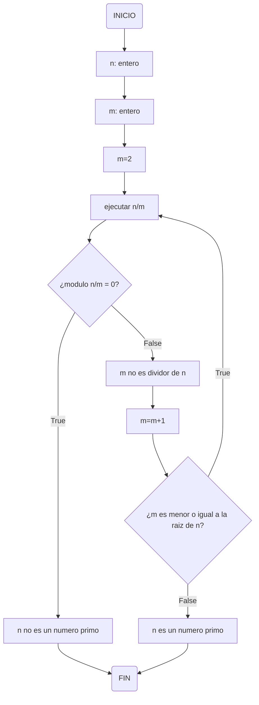

# RETO-3-Pseudocodigo-y-Diagramas-de-Flujo

```pseudocode
n : entero
m : entero
inicio
  m := 2
  Mientras (m <= n**0.5 + 1) hacer
    n/m
    Si modulo (n,m) == 0 entonces
      escribir ("n no es un numero primo")
    sino
      escribir ("m no es divisor de n, n puede ser primo")
      m := m+1
      Si (m >= n**0.5) entonces
        escribir ("n es un numero primo")
  Fin Mientras
fin
```


