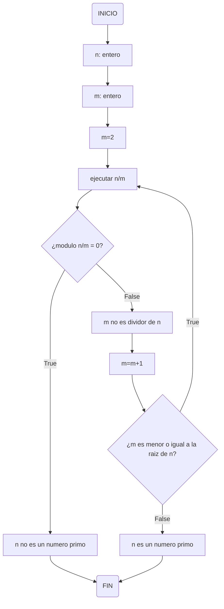
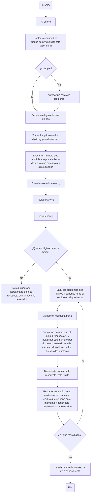

# RETO-3-Pseudocodigo-y-Diagramas-de-Flujo
En este repositorio encontrará el desarrollo del reto tres, el cual cuenta con dos ejercicios: un algoritmo para obtener los números primos hasta un número n, y un algoritmo para hallar raíces cuadradas solo con su procedimiento matemático. Cada uno de estos ejercicios cuenta con su diagrama de flujo y pseudocódigo.

ALGORITMO PARA OBTENER LOS NÚMEROS PRIMOS HASTA UN NÚMERO n

Pseudocódigo números primos


```pseudocode
n : entero
m : entero
inicio
  m := 2
  Mientras (m <= n**0.5 + 1) hacer
    n/m
    Si modulo (n,m) == 0 entonces
      escribir ("n no es un numero primo")
    sino
      escribir ("m no es divisor de n, n puede ser primo")
      m := m+1
      Si (m >= n**0.5) entonces
        escribir ("n es un numero primo")
  Fin Mientras
fin
```

Diagrama de flujo números primos




ALGORITMO PARA HALLAR BAJO SU PROCEDIMIENTO MATEMÁTICO UNA RAÍZ CUADRADA


Pseudocódigo raíz cuadrada


```pseudocode
n : entero
m : entero
inicio
n:= número a sacar la raíz cuadrada
m:= cantidad de dígitos de n
Si (m%2 != 0):
  añadir un cero a la izquierda del número
  m+=1
FinSi
Separar los dígitos de n de dos en dos
Tomar los primeros dos dígitos y guardarlos en x
Buscar un número que multiplicado por si mismo de x o lo más cercano posible sin excederlo, guardar este número en y
respuesta:= y
residuo:= x-y**2
m=m-2
Mientras (m>0) hacer
  Bajar los siguientes dos dígitos de n y ubicarlos al lado de residuo
  Multiplicar respuesta por 2
  Buscar un número z que al unirlo con respuesta*2 al lado y multiplizarlo por z dé el número más cercano posible a residuo
  Restar a residuo la multiplicación de z por respuesta*2 con z, y establecer este valor como nuevo residuo
  Añadir z a la respuesta (al lado)
  m=m-2
FinMientras
escribir ("la raíz cuadrada de n aproximada es respuesta, con un residuo de residuo")
Fin
```


Diagrama de flujo raíz cuadrada



  
